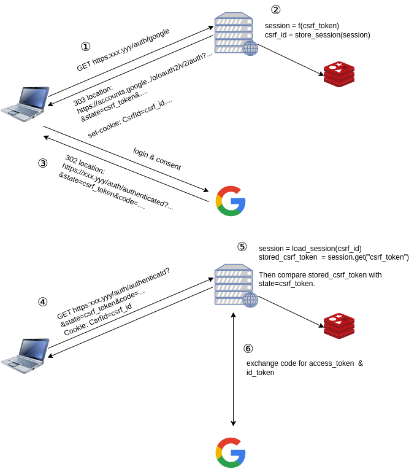

# axum google oauth2 example

もともとdiscord用の[axum/examples/oauth](https://github.com/tokio-rs/axum/blob/main/examples/oauth/src/main.rs)を改造

```text
ngrok http 3000
```

ngrokのURLをORIGINに設定

```text
export ORIGIN="https://xxxxx.ngrok-free.app"
export CLIENT_ID=$client_id
export CLIENT_SECRET=$client_secret

cargo watch -x run
```

## security enhancement by csrf_token



- storeにCsrfIdをキーとして保存されているcsrf_tokenと、stateにセットされているcsrf_tokenが一致しないと、⑥以降の処理に進まない。
- 攻撃者が、③までを実行すると、正しいcsrf_token、CsrfId、Auth codeを入手することができてしまう
- 攻撃者は、被害者を攻撃者のアカウントにログインさせることで、不正に情報を取得するなどが可能になる
  - [攻撃の例](csrf-attack-example.md)

- `_Host-` プリフィックスにより、Cookieがそのホストにによりセットされたことが保証される。
- `User-Agent`チェックを行うことで、攻撃を若干難しくすることができるかも？？？
- Origin/Refererチェックにより、`https://accounts.google.com`からの遷移であることが保証される。
